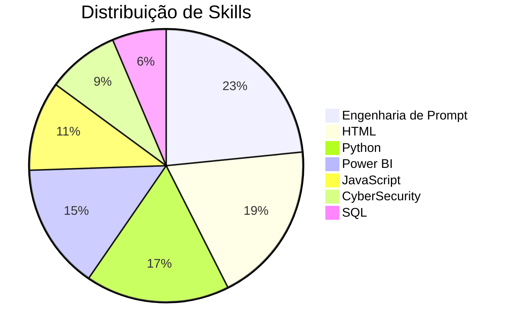

<div align="center">

# 👋 Olá, eu sou **Filipe Gabriel**

### 🤖 Estudante de IA e Dados | Instituto Caldeira 🚀

*Explorando o futuro através de dados e inteligência artificial*

[](https://git.io/typing-svg)

</div>

---

## 🚀 **Sobre Mim**

Sou um estudante apaixonado por **Inteligência Artificial** e **Ciência de Dados** no Instituto Caldeira, sempre em busca de novos desafios e oportunidades para aplicar tecnologia na solução de problemas reais. Combino conhecimentos técnicos sólidos com criatividade para desenvolver soluções inovadoras.

- 🔭 Atualmente estudando **IA e Dados** no **Instituto Caldeira**
- 🌱 Explorando **Machine Learning**, **Deep Learning** e **Data Analytics**
- 💡 Interessado em **Cybersecurity** e **Engenharia de Prompt**
- 🎯 Objetivo: Contribuir para o avanço da tecnologia através de dados

---

## 🛠️ **Hard Skills**

### **Linguagens de Programação**
<div style="margin: 10px 0;">

**Python** 
<div style="background: #e0e0e0; border-radius: 10px; overflow: hidden;">
  <div style="background: linear-gradient(90deg, #3776ab, #4b8bbe); height: 20px; width: 40%; display: flex; align-items: center; justify-content: flex-end; padding-right: 10px; color: white; font-size: 12px; font-weight: bold;">40%</div>
</div>

**JavaScript** 
<div style="background: #e0e0e0; border-radius: 10px; overflow: hidden;">
  <div style="background: linear-gradient(90deg, #f7df1e, #f0db50); height: 20px; width: 25%; display: flex; align-items: center; justify-content: flex-end; padding-right: 10px; color: black; font-size: 12px; font-weight: bold;">25%</div>
</div>

**SQL** 
<div style="background: #e0e0e0; border-radius: 10px; overflow: hidden;">
  <div style="background: linear-gradient(90deg, #336791, #4e7ba7); height: 20px; width: 15%; display: flex; align-items: center; justify-content: flex-end; padding-right: 10px; color: white; font-size: 12px; font-weight: bold;">15%</div>
</div>

**HTML** 
<div style="background: #e0e0e0; border-radius: 10px; overflow: hidden;">
  <div style="background: linear-gradient(90deg, #e34f26, #f16529); height: 20px; width: 45%; display: flex; align-items: center; justify-content: flex-end; padding-right: 10px; color: white; font-size: 12px; font-weight: bold;">45%</div>
</div>

</div>

### **Ferramentas & Especialidades**
<div style="margin: 10px 0;">

**Power BI** 
<div style="background: #e0e0e0; border-radius: 10px; overflow: hidden;">
  <div style="background: linear-gradient(90deg, #f2c811, #f4d03f); height: 20px; width: 35%; display: flex; align-items: center; justify-content: flex-end; padding-right: 10px; color: black; font-size: 12px; font-weight: bold;">35%</div>
</div>

**CyberSecurity** 
<div style="background: #e0e0e0; border-radius: 10px; overflow: hidden;">
  <div style="background: linear-gradient(90deg, #dc143c, #ff6b6b); height: 20px; width: 20%; display: flex; align-items: center; justify-content: flex-end; padding-right: 10px; color: white; font-size: 12px; font-weight: bold;">20%</div>
</div>

**Engenharia de Prompt** 
<div style="background: #e0e0e0; border-radius: 10px; overflow: hidden;">
  <div style="background: linear-gradient(90deg, #9b59b6, #be90d4); height: 20px; width: 55%; display: flex; align-items: center; justify-content: flex-end; padding-right: 10px; color: white; font-size: 12px; font-weight: bold;">55%</div>
</div>

</div>
## 📊 **Skills Dashboard**

<div align="center">

### 🎯 **Competências Técnicas**

<table>
<tr>
<td align="center" width="50%">

**💻 DESENVOLVIMENTO**
```
┌─────────────────────────────────┐
│  Python         ████      40%  │
│  JavaScript     ██▌       25%  │
│  SQL            █▌        15%  │
│  HTML           ████▌     45%  │
└─────────────────────────────────┘
```

</td>
<td align="center" width="50%">

**🛠️ FERRAMENTAS & ESPECIALIDADES**
```
┌─────────────────────────────────┐
│  Power BI       ███▌      35%  │
│  CyberSecurity  ██        20%  │
│  Prompt Eng.    █████▌    55%  │
└─────────────────────────────────┘
```

</td>
</tr>
</table>

### 📈 **Métricas de Performance**

<div style="display: flex; justify-content: space-around; margin: 20px 0;">

| 🎯 **Categoria** | 📊 **Nível** | 🚀 **Status** |
|:---:|:---:|:---:|
| **IA & Machine Learning** | `Iniciante+` | 🌱 Aprendendo |
| **Data Science** | `Iniciante` | 📚 Estudando |
| **Cybersecurity** | `Iniciante` | 🛡️ Explorando |
| **Prompt Engineering** | `Intermediário` | 📈 Desenvolvendo |

</div>

### 🏆 **Ranking de Habilidades**



</div>

---

## 💻 **Stack Tecnológica**

<div align="center">


</div>

---

## 📊 **Estatísticas GitHub**

<div align="center">
  
  
</div>

<div align="center">
  
</div>

---

## 🎯 **Áreas de Interesse**

```python
areas_interesse = {
    "Inteligência_Artificial": ["Machine Learning", "Deep Learning", "NLP"],
    "Ciência_de_Dados": ["Data Analytics", "Data Mining", "Big Data"],
    "Segurança": ["Ethical Hacking", "Threat Analysis", "Security Protocols"],
    "Desenvolvimento": ["Web Development", "API Development", "Automation"],
    "Inovação": ["Prompt Engineering", "AI Applications", "Tech Solutions"]
}
```

---

## 🏆 **Conquistas**

- 🎓 **Estudante** no **Instituto Caldeira** - Programa de IA e Dados
- 💻 **Desenvolvedor** em constante aprendizado
- 🔐 **Entusiasta** de Cybersecurity
- 🤖 **Especialista** em Engenharia de Prompt
- 📊 **Analista** de dados em formação

---

## 📫 **Vamos Conectar?**

<div align="center">

[](https://linkedin.com/in/filipegabriel)
[](https://github.com/filipegabriel)
[](mailto:filipe@email.com)
[](https://filipegabriel.dev)

</div>

---

<div align="center">

### *"A inteligência artificial não é sobre substituir humanos, mas sobre amplificar nossa capacidade de resolver problemas complexos."* 

**✨ Sempre aberto para colaborações e novos desafios! ✨**


</div>
