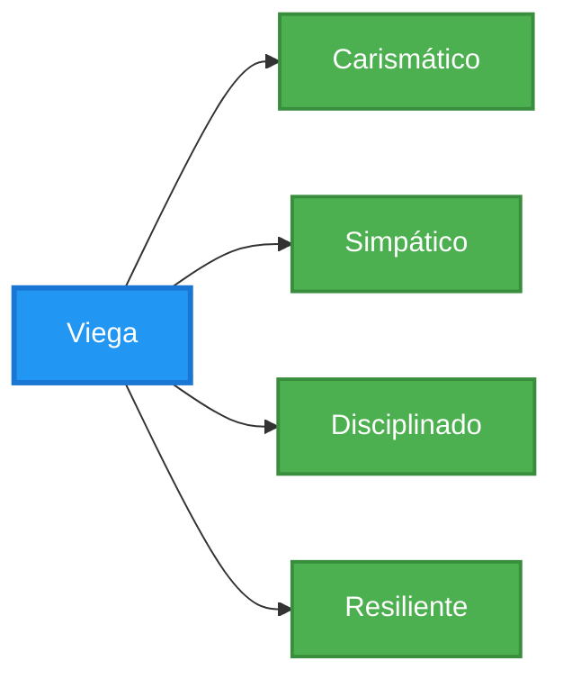

# 👋 Olá, eu sou Filipe Gabriel Veiga de Paula

### Mais conhecido como **Viega** | Nascido em 2006 🚀

---

## 🎯 Sobre Mim

> **Um dos 200 selecionados entre 18.000 candidatos no Geração Caldeira**

Atualmente cursando **IA e Dados** no programa Geração Caldeira, estou em uma jornada intensa de aprendizado e desenvolvimento na área de tecnologia. Apaixonado por dados, inteligência artificial e segurança da informação, busco sempre combinar conhecimento técnico com soft skills que fazem a diferença.

---

## 💻 Hard Skills

| Tecnologia | Proficiência |
|-----------|--------------|
|  **SQL** |  |
|  **Python** |  |
|  **JavaScript** |  |
|  **React** |  |
|  **HTML** |  |
|  **Power BI** |  |
|  **Prompt Engineering** |  |
|  **CyberSecurity** |  |

---

## 🌟 Soft Skills

| Soft Skill | Descrição |
|-----------|-----------|
| 🎭 **Carismático** | Facilidade em criar conexões e engajar pessoas |
| 😊 **Simpático** | Abordagem positiva e colaborativa no ambiente de trabalho |
| 💪 **Disciplinado** | Comprometimento e consistência nos estudos e projetos |
| 🔥 **Resiliente** | Capacidade de superar desafios e aprender com adversidades |

---

## 🏆 Conquistas

- ✅ **Selecionado entre os 200 finalistas** de 18.000 candidatos no Geração Caldeira
- 📚 Estudante de **IA e Dados** no Geração Caldeira
- 💼 Desenvolvendo projetos em **Ciência de Dados** e **Inteligência Artificial**
- 🔒 Explorando o universo da **CyberSecurity**

---

## 🎯 Objetivos 2025

- [ ] Concluir o programa Geração Caldeira com excelência
- [X] Desenvolver projetos com os meus novo conhecimentos
- [ ] Contribuir para projetos open source
- [ ] Expandir network na área de tecnologia

---

## 🛠️ Tecnologias & Ferramentas

---

### 💡 "A única maneira de fazer um excelente trabalho é amar o que você faz." - Steve Jobs

---

**⭐ Se você gostou do meu perfil, não esqueça de dar uma estrela nos repositórios!**

