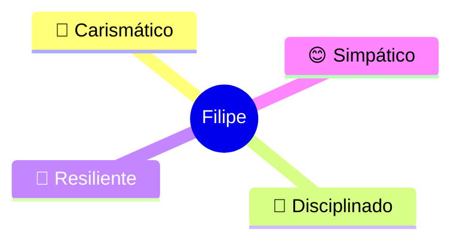

# 👋 Olá! Eu sou Filipe Gabriel Veiga de Paula

  

## 🎯 Sobre Mim

Sou um dos **200 selecionados** entre **18 mil candidatos** para integrar o prestigioso programa **Geração Caldeira** 🔥

Atualmente me dedico ao estudo intensivo de **Inteligência Artificial** e **Análise de Dados**, buscando constantemente evoluir minhas habilidades técnicas e contribuir com projetos inovadores.

---

## 🚀 Hard Skills

| Skill | Proficiência |
|:------|:-------------|
| 🔥 **Prompt Engineering** |  |
| 📊 **Power BI** |  |
| 🐍 **Python** |  |
| 🌐 **HTML** |  |
| 💻 **JavaScript** |  |
| 🔐 **Cybersecurity** |  |
| 🗄️ **SQL** |  |
| ⚛️ **React** |  |

---

## 💎 Soft Skills

| Soft Skill | Descrição |
|:----------:|:---------:|
| 🌟 **Carismático** | Facilidade em criar conexões e engajar equipes |
| 💪 **Disciplinado** | Comprometimento com metas e prazos |
| 🔄 **Resiliente** | Capacidade de superar desafios |
| 😊 **Simpático** | Ambiente colaborativo e positivo |

---

## 📊 GitHub Stats

  

---

## 🏆 Conquistas

---

## 📫 Conecte-se Comigo

---

## 🌱 Atualmente Estudando

- 🤖 **Machine Learning & Deep Learning**
- 📊 **Data Science & Analytics**
- 🧠 **Natural Language Processing**
- 🔐 **Cybersecurity Fundamentals**
- ⚛️ **React & Modern Web Development**

---

## 💻 Principais Projetos

---

### 🔥 Geração Caldeira - Transformando o Futuro com IA e Dados

**"A persistência é o caminho do êxito"** 💫

