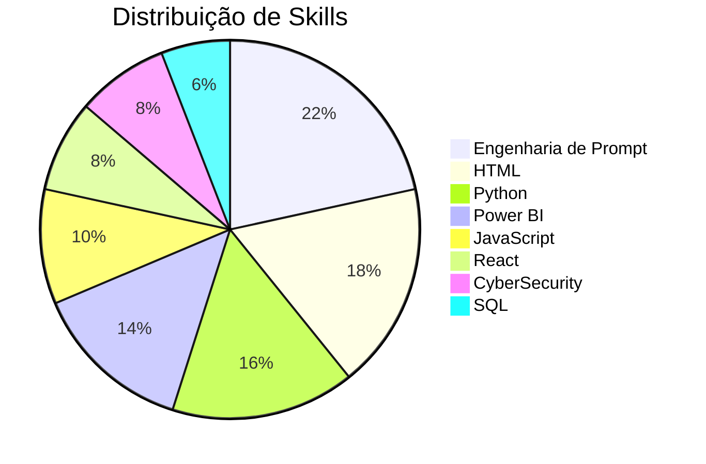
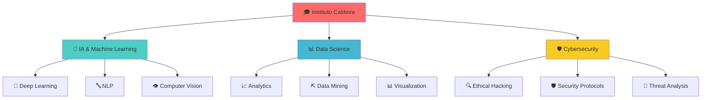

# 👋 Olá, eu sou **Filipe Gabriel**

### 🤖 Estudante de IA e Dados | Instituto Caldeira 🚀

*Explorando o futuro através de dados e inteligência artificial*

---

## 🚀 **Sobre Mim**

Sou um estudante apaixonado por **Inteligência Artificial** e **Ciência de Dados** no Instituto Caldeira, sempre em busca de novos desafios e oportunidades para aplicar tecnologia na solução de problemas reais. Combino conhecimentos técnicos sólidos com criatividade para desenvolver soluções inovadoras.

- 🔭 Atualmente estudando **IA e Dados** no **Instituto Caldeira**
- 🌱 Explorando **Machine Learning**, **Deep Learning** e **Data Analytics**
- 💡 Interessado em **Cybersecurity** e **Engenharia de Prompt**
- 🎯 Objetivo: Contribuir para o avanço da tecnologia através de dados

---

| 🎯 **Skill** | 📊 **Level** | 🔥 **Progress** | 🎨 **Visual** |
|:---:|:---:|:---:|:---:|
| **🤖 Prompt Engineering** | `55%` | `█████████████▌░░░░░░` | 🟢 **Avançando** |
| **📄 HTML** | `45%` | `███████████▌░░░░░░░░` | 🟡 **Desenvolvendo** |
| **🐍 Python** | `40%` | `████████░░░░░░░░░░░░` | 🟡 **Aprendendo** |
| **📊 Power BI** | `35%` | `████████▌░░░░░░░░░░░` | 🟡 **Praticando** |
| **🌐 JavaScript** | `25%` | `██████▌░░░░░░░░░░░░░` | 🟠 **Estudando** |
| **⚛️ React** | `20%` | `█████░░░░░░░░░░░░░░░` | 🔴 **Explorando** |
| **🛡️ CyberSecurity** | `20%` | `█████░░░░░░░░░░░░░░░` | 🔴 **Explorando** |
| **🗃️ SQL** | `15%` | `███▌░░░░░░░░░░░░░░░░` | 🔴 **Iniciante** |

### 🏆 **Ranking de Habilidades**

---

## 💻 **Stack Tecnológica**

---

### 🎨 **Roadmap de Aprendizado**

## 🏆 **Conquistas**

- 🎓 **Estudante** no **Instituto Caldeira** - Programa de IA e Dados
- 💻 **Desenvolvedor** em constante aprendizado
- 🔐 **Entusiasta** de Cybersecurity
- 🤖 **Especialista** em Engenharia de Prompt
- 📊 **Analista** de dados em formação

---

## 📫 **Vamos Conectar?**

---

### *"A inteligência artificial não é sobre substituir humanos, mas sobre amplificar nossa capacidade de resolver problemas complexos."* 

**✨ Sempre aberto para colaborações e novos desafios! ✨**

